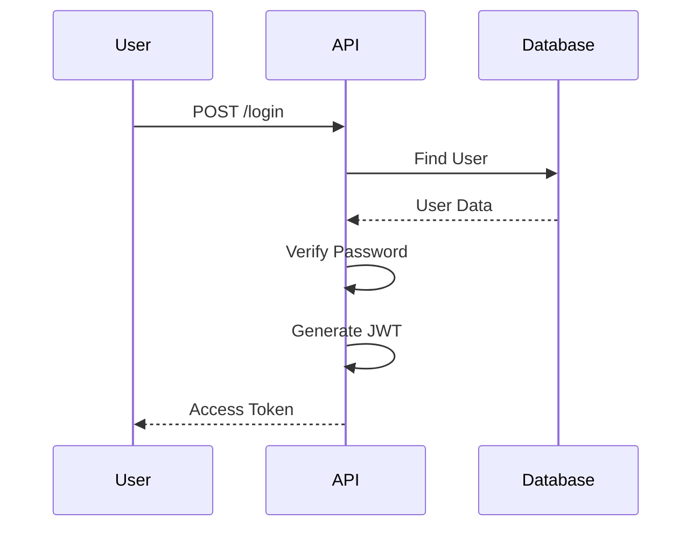
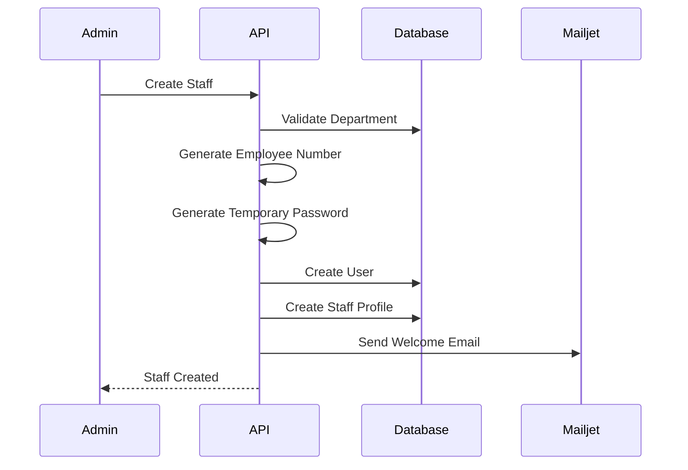
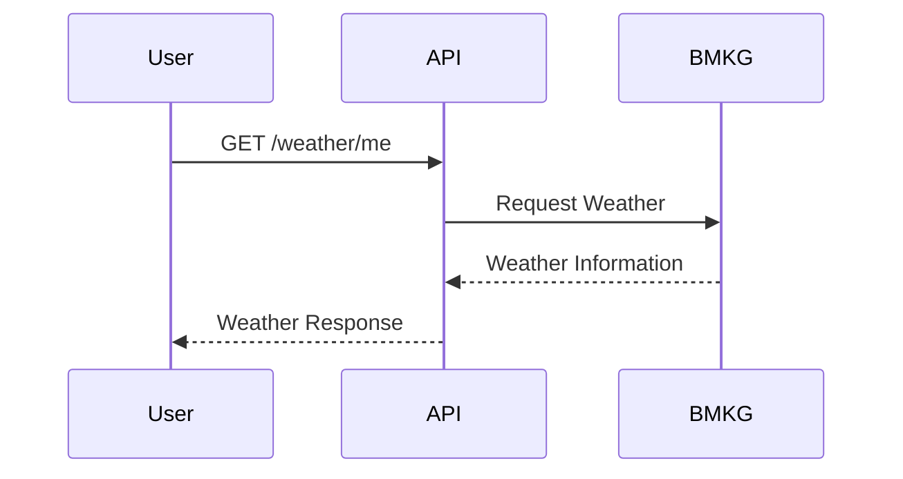
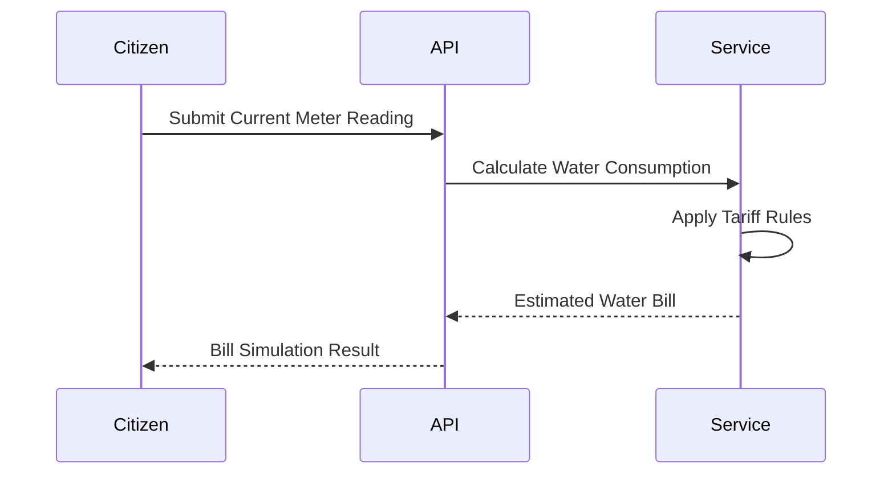

# 🏙️ Urbioxe - Smart City Services Management API

<div align="center">

RESTful Backend API for Smart City digital services built with **Golang**, **Echo Framework**, **PostgreSQL**, and **Layered Architecture**.

Designed to improve communication between citizens and local government through secure, scalable, and maintainable backend services.

</div>

---

# 📖 Description

Urbioxe is a Smart City backend platform that provides centralized digital public services for citizens, government officers, and administrators.

The platform enables citizens to submit public reports, access emergency contacts, retrieve district weather information, monitor water service status, submit water meter readings, simulate water bills, and stay informed through official government news. Government officers can manage reports, departments, districts, categories, emergency contacts, and staff through a secure Role-Based Access Control (RBAC) system.

This project was developed as a Final Project for the Hacktiv8 Golang Backend Bootcamp while applying production-ready backend development practices including layered architecture, repository pattern, dependency injection, JWT authentication, third-party integrations, Docker, and unit testing.

---

# ✨ Features

## Highlights

- 🏙️ Smart City Services Management Platform
- 💧 Smart Water Management Modules
- 🔐 JWT Authentication & Role-Based Access Control (RBAC)
- 🏗️ Layered Architecture with Repository Pattern
- 🌤️ BMKG Weather API Integration
- ☁️ Cloudinary Image Upload
- 📧 Automated Email Notification with Mailjet
- 🐳 Dockerized Deployment
- 🧪 Unit Testing with GoMock & Testify

---

## 🔐 Authentication

- Register User
- Login User
- JWT Authentication
- Role-Based Access Control (RBAC)
- Change Password

---

## 👤 User

- Get Profile
- Update Profile
- Change Password

---

## 🏘 District Management

- Get All Districts
- Get District Detail
- Create District
- Update District
- Activate / Deactivate District

---

## 🏢 Department Management

- Get All Departments
- Get Department Detail
- Create Department
- Update Department
- Activate / Deactivate Department

---

## 📂 Category Management

- Get All Categories
- Get Category Detail
- Create Category
- Update Category
- Activate / Deactivate Category

---

## 👨‍💼 Staff Management

- Create Staff
- Update Staff
- View Staff List
- View Staff Detail
- Activate / Deactivate Staff
- Automatic Employee Number Generation
- Welcome Email Notification

---

## 🚨 Emergency Contact

- Get Emergency Contacts
- Get Emergency Contact Detail
- Create Emergency Contact
- Update Emergency Contact
- Activate / Deactivate Emergency Contact

---

## 🌤 Weather

- Get Weather by District
- Get Weather by Current User Location
- Synchronize Weather and Forecast Data from BMKG API

---

## 💧 Water Status

- Get Water Status by District
- Get Water Status by Current User Location
- Synchronize Water Status Data

---

## 💦 Water Meter Reading

- Submit Water Meter Reading
- Upload Meter Photo
- View Water Meter Reading History
- Validate Meter Reading

---

## 🧾 Water Bill Simulation

- Simulate Water Bill
- Calculate Estimated Water Consumption
- View Estimated Monthly Water Charges

---

## 📰 News

- Create News
- Update News
- Publish News
- Archive News
- Get News List
- Get News Detail

---

## 📢 Public Report

- Create Public Report
- Upload Evidence Image
- Category Assignment
- Department Assignment
- Report Status Tracking
- Report History
- Officer Handling Workflow

---

## 📧 Notification

- Welcome Staff Email
- Mailjet Integration

---

# 🚀 Tech Stack

| Technology         | Description                        |
| ------------------ | ---------------------------------- |
| Golang             | Programming Language               |
| Echo Framework     | HTTP Framework                     |
| PostgreSQL         | Relational Database                |
| GORM               | ORM                                |
| JWT                | Authentication                     |
| Docker             | Containerization                   |
| Mailjet            | Email Notification                 |
| Cloudinary         | Image Storage                      |
| BMKG API           | Weather Information                |
| Smart Water Module | Water Monitoring & Bill Simulation |
| GoMock             | Unit Testing                       |
| Testify            | Assertions                         |
| Postman            | API Testing                        |

---

# 🏗 Architecture

```
                        Client Applications
                               │
                               ▼
                        Echo HTTP Router
                               │
                    JWT / ACL Middleware
                               │
                               ▼
                        Controller Layer
                               │
                               ▼
                         Service Layer
                               │
                               ▼
                       Repository Layer
                               │
             ┌─────────────────┴─────────────────┐
             ▼                                   ▼
       PostgreSQL Database               External Services
                                                │
                           ┌──────────────┬──────────────┐
                           ▼              ▼              ▼
                      Mailjet       Cloudinary         BMKG
```

The project follows **Layered Architecture**, separating HTTP delivery, business logic, and database access to improve maintainability, scalability, and testability.

---

# 🔄 Business Flow

## Public Report Workflow

```text
Citizen

    │

    ▼

Create Report

    │

    ▼

Validate Category

    │

    ▼

Assign Responsible Department

    │

    ▼

Officer Handles Report

    │

    ▼

Update Report Status

    │

    ▼

Report Completed
```

---

## Authentication Flow



---

## Staff Registration Flow



---

## Weather Synchronization Flow



---

## Water Bill Simulation Flow



---

# 📂 Project Structure

```text
cmd/
docs/
sql/

internal/
│
├── config/
├── constant/
├── controller/
├── dto/
├── entity/
├── errs/
├── helper/
├── middleware/
├── repository/
├── router/
└── service/

external/
│
├── cloudinary/
├── mailjet/
└── weather/
```

---

# ⚙️ Installation

## Clone Repository

```bash
git clone <repository-url>

cd urbioxe
```

---

## Install Dependencies

```bash
go mod tidy
```

---

## Configure Environment Variables

Create `.env`

```env
APP_PORT=8080

DB_HOST=
DB_PORT=
DB_USER=
DB_PASSWORD=
DB_NAME=
DB_SSLMODE=

JWT_SECRET=

MAILJET_BASE_URL=https://api.mailjet.com
MAILJET_API_KEY=
MAILJET_SECRET_KEY=
MAILJET_SENDER_EMAIL=
MAILJET_SENDER_NAME=

CLOUDINARY_CLOUD_NAME=
CLOUDINARY_API_KEY=
CLOUDINARY_API_SECRET=

BMKG_BASE_URL=https://api.bmkg.go.id
BMKG_FORECAST_ENDPOINT=publik/prakiraan-cuaca
```

---

## Create Database

Run SQL scripts located in:

```text
sql/
```

---

## Run Application

```bash
go run ./cmd
```

Server will run at

```
http://localhost:8080
```

---

# 🐳 Docker

Run using Docker Compose

```bash
docker compose up --build
```

---

# 📬 API Documentation

Complete API documentation and example requests are available in the Postman Collection included in this repository.

[Postman](https://documenter.getpostman.com/view/27897753/2sBY4Mw2bC)

```
Urbioxe API.postman_collection.json
```

---

# 🔗 Third Party Services

## BMKG API

Provides real-time forecast district weather information.

---

## Mailjet

Sends automatic welcome emails for newly created staff.

---

## Cloudinary

Stores uploaded report images securely.

---

# 🔒 Security

- JWT Authentication
- Role-Based Access Control (RBAC)
- Password Hashing (bcrypt)
- Request Validation
- Centralized Error Handling

---

# 🧪 Testing

Unit testing is implemented using

- Go Testing
- GoMock
- Testify

Run

```bash
go test ./...
```

---

# 🚀 Future Improvements

- Push Notification
- Redis Caching
- GIS / Interactive City Map
- Smart Water Consumption Analytics
- Online Water Bill Payment Integration
- WebSocket Real-Time Notification
- AI Report Classification
- Dashboard Analytics
- Microservices Architecture
- CI/CD Pipeline

---

# 👨‍💻 Authors

Developed by **Team Urbioxe**

- **Raka Mancini** — Tech Lead & Backend Engineer  
  [GitHub](https://github.com/manciniraka)

- **Nunin Farid Zahrotin Ula** — Backend Engineer  
  [GitHub](https://github.com/nuninnih)

- **R Tio Genta Komara** — Backend Engineer  
  [GitHub](https://github.com/komacato)

- **Imanuel** — Backend Engineer  
  [GitHub](https://github.com/imanuelss)

Hacktiv8 Golang Backend Final Project

---
